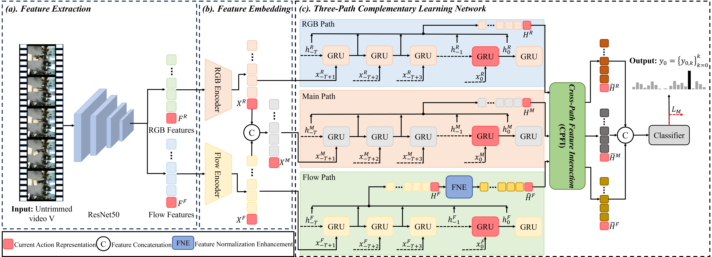
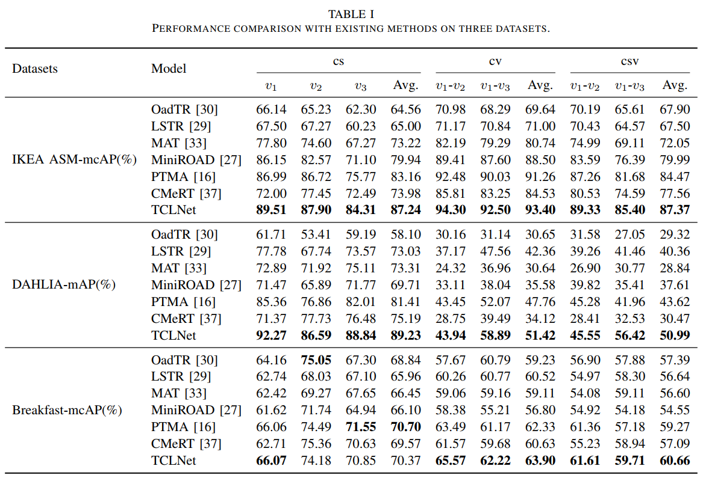

# TCLNet: A Three-Path Complementary Learning Network for Cross-View Online Action Detection

## Code Availability
The source code is currently under preparation and will be publicly released upon acceptance of the paper for publication in ***IEEE Transactions on Multimedia (TMM)***.

## 1、Model architecture diagram

## 2、Selected experimental results

## Author's Contact
Email：yang_lu@seu.edu.cn

